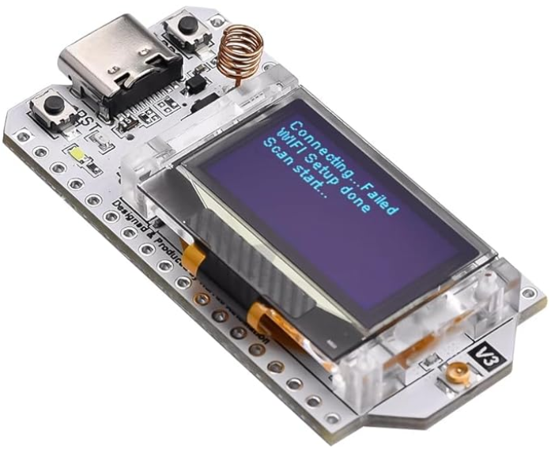

# Heltec WiFi LoRa 32 (V3)

{ width="500" .center}
*Heltec WiFi LoRa 32 (V3)* 
{: .center }

> ⚠️ **Attention : toujours connecter l’antenne hors tension**.  
> Ne jamais alimenter la carte sans antenne, au risque d’endommager le module radio.  
> Ce matériel est fragile !

## Présentation

La **Heltec WiFi LoRa 32 (V3)** est une carte à base d’ESP32 intégrant :
- un module radio **LoRa 868 MHz**,
- un écran **OLED 0.96"**,
- un port **USB-C**,
- et une interface batterie **LiPo**.

Elle permet :  
- d’expérimenter **Meshtastic**, un protocole de communication maillée LoRa,  
- de tester la **communication LoRa point-à-point**,  
- d’explorer l’IoT longue portée.  

## Questions à se poser avant de commencer

🔗Lire la [documentation Meshtastic](https://meshtastic.org/docs/introduction/) pour être capable de répondre aux questions :  
- ❓ Qu’est-ce que *Meshtastic* ?  
- ❓ Qu’est-ce que *LoRa* ?  
- ❓ Quelles sont les deux fréquences radio utilisées en Europe ? 

## Tutoriels disponibles
- [🛰️ Tuto 1 : Découverte et Meshtastic](tuto-1-meshtastic.md)
- [📡 Tuto 2 : Communication LoRa sans Meshtastic](tuto-2-lora-sans-meshtastic.md)
