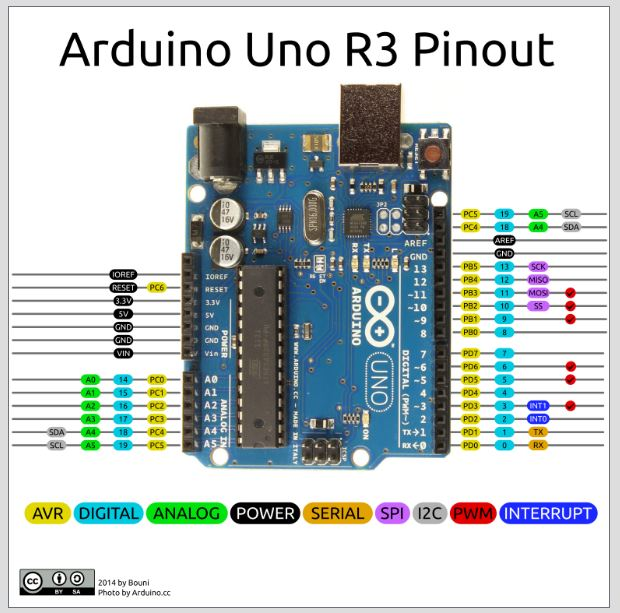
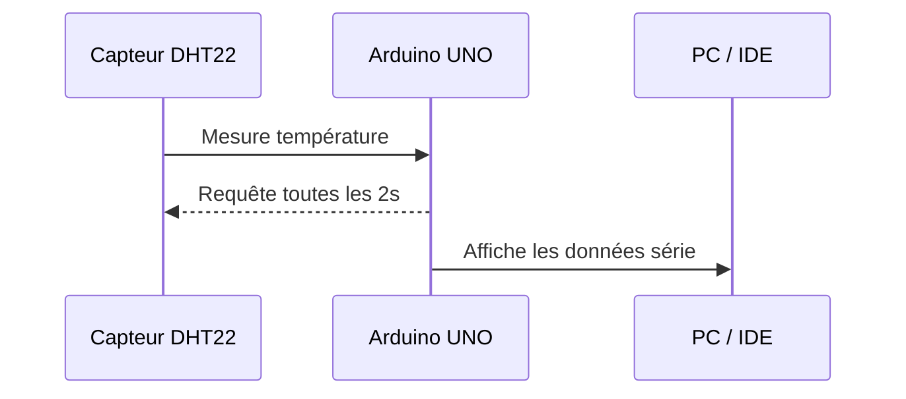

# Catalogue composants CIEL — Exemples de mise en page

Bienvenue sur ce site de démonstration !  
Ce document illustre les **possibilités offertes par MkDocs Material** sur GitHub Pages, utilisées pour présenter les tutoriels et exemples Arduino / PlatformIO du BTS et Bac Pro CIEL.

---

## 🧭 Introduction

!!! info "À propos"
    MkDocs Material permet d’écrire des documents clairs, illustrés, et interactifs — parfaits pour documenter vos projets techniques, TP ou exemples Arduino.

    La documentation est écrite au format Markdown .md dans les répertoires des composants et convertie en site web automatiquement par MkDocs pour GitHub Pages.

---

## 🧱 Titres, texte et listes

### Niveaux de titre

#### Sous-titre de niveau 4
##### Sous-titre de niveau 5
###### Sous-titre de niveau 6

### Mise en forme

Vous pouvez combiner :

- **Gras**
- *Italique*
- `Monospace`
- ==Surligné==
- ~~Barré~~  
- Et même <span style="color:#27ae60; font-weight:bold;">du texte coloré</span> avec du HTML.

### Listes

- Liste non ordonnée
    - Sous-liste
- [x] Liste à cases cochées
- [ ] Élément non coché


Les listes ordonées sont possibles aussi .

1. Liste ordonnée
       1. Premièrement
       2. Deuxièmement
2. Deuxième point

---

## ⚙️ Admonitions

!!! tip "Astuce"
    Définissez vos admonitions avec `!!! tip`, `!!! warning`, `!!! note`, etc.

!!! warning "Attention"
    Débranchez toujours **l’alimentation** avant de connecter ou déconnecter une antenne.

!!! example "Exemple"
    ```cpp
    digitalWrite(LED_BUILTIN, HIGH);
    delay(1000);
    digitalWrite(LED_BUILTIN, LOW);
    delay(1000);
    ```

!!! note "Note"
    Première ligne de la note.

    Second paragraphe avec **gras** et liste :

    - item 1
    - item 2
        - sous-item

    ```python
    print("code dans la note")
    ```

---

## 🧰 Code et onglets

=== "Arduino IDE"
    ```cpp
    #include <Arduino.h>

    void setup() {
      Serial.begin(9600);
      Serial.println("Exemple Arduino IDE");
    }

    void loop() {
      delay(1000);
    }
    ```

=== "PlatformIO"
    ```ini
    [env:uno]
    platform = atmelavr
    board = uno
    framework = arduino
    monitor_speed = 115200
    monitor_filters = colorize, time, send_on_enter
    monitor_eol = LF         ; IMPORTANT (mets LF)
    monitor_echo = yes       ; pour voir ce que TU tapes
    ```

---

## 🖼️ Images et figures

{ width="500" .center}
*Arduino Uno R3 — carte de référence utilisée pour les TP.* 
{: .center }

!!! note
    Les images peuvent être placées dans un sous-répertoire `images/` du composant ou du tutoriel.


Version structurée avec légende (attention, le chemin est à rentrer à la main (voir code source))
<figure class="center">
  
  <figcaption>Arduino Uno R3 — carte de référence utilisée pour les TP.</figcaption>
</figure>

---

## 📊 Tableaux et couleurs

| Capteur | Fonction principale | Niveau | Statut |
|:---------|:--------------------|:-------|:-------:|
| DHT22 | Température / humidité | Bac Pro | ✅ |
| MPU6050 | Accéléromètre / gyroscope | BTS 1re année | ⚙️ |
| Heltec LoRa 32 V3 | Communication longue portée | BTS 2e année | 🚧 |

---

## 🧮 Mathématiques

Les équations peuvent être rendues avec LaTeX :

$$
U = R \times I
$$

et aussi en ligne :  $f(x) = x^2 + 2x + 1$.


---

## 📈 Diagramme Mermaid

Un diagramme de communication typique :



## Et enfin un exemple de lien interne et externe

Voici un lien interne [Mise en page](./MiseEnPage.md), un lien externe [Documentation Arduino](https://www.arduino.cc/) et une ancre [Aller aux images](#images-et-figures).

```markdown
Voici un lien interne [Mise en page](./MiseEnPage.md),
un lien externe [Documentation Arduino](https://www.arduino.cc/),
et une ancre [Aller aux images](#images-et-figures)
```